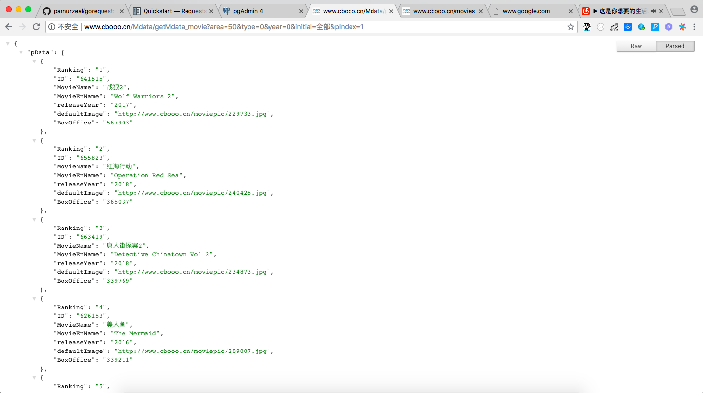

## CBO 分析

#### 1. 网站

URLRoot = http://www.cbooo.cn/

##### 1 实时票房

- URL
- http://www.cbooo.cn/BoxOffice/GetHourBoxOffice?d=1533363522535
- dataType: json
- Get

##### 2. 单日票房

- URL
- http://www.cbooo.cn/BoxOffice/GetDayBoxOffice?num=-1&d=1533363738294
- dataType: json
- Get

##### 3. 单周票房

- URL
- http://www.cbooo.cn/BoxOffice/getWeekInfoData?sdate=2018-07-23
- dataType: json
- Get

##### 4. 周末票房

- URL
- http://www.cbooo.cn/BoxOffice/getWeekendInfoData?selDate=2018-07-27%262018-07-29%7C2018-07-20%262018-07-22
- dataType: json
- Get

##### 5. 单月票房

- URL
- http://www.cbooo.cn/BoxOffice/getMonthBox?sdate=2018-08-01
- dataType: json
- Get

##### 6. 年度票房

- URL
- http://www.cbooo.cn/year?year=2018
- dataType: html
- Get

##### 7. 全球票房

- URL
- http://www.cbooo.cn/BoxOffice/getAllInfo?weekId=5313
- dataType: html
- Get

##### 8. 历史票房

- URL
- http://www.cbooo.cn/history
- dataType: html
- Get

##### 9. 影院票房

- URL
- http://www.cbooo.cn/BoxOffice/getCBD?pIndex=1&dt=2018-08-03
- dataType: json
- Get

##### 10. 影库

- URL
- http://www.cbooo.cn/Mdata/getMdata_movie?area=50&type=0&year=0&initial=%E5%85%A8%E9%83%A8&pIndex=1
- dataType: json
- Get

#### 2. 分析影库

获取地区代号：中国 50，类型：全部 0

- http://www.cbooo.cn/movies

定义需要的字段

