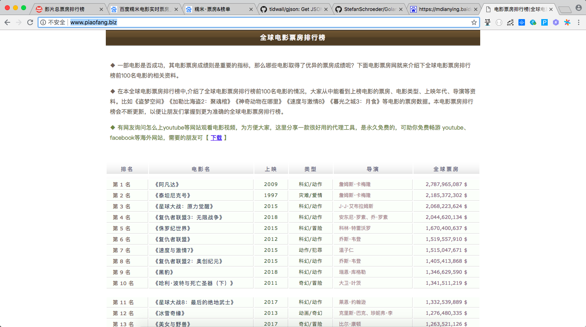

### 全球票房排行榜

#### 1. 网址

Method|URL|Type|
---|---|---|
GET|http://www.piaofang.biz/|html|


#### 2. 分析





#### 3. 正则表达式

```
	// <td class="num"><u>全球电影票房排行榜</u>第 1 名</td>
	rankPattern = `<tr><td class="num">(.*?)</td>`
	// <td class="title">《阿凡达》<span>Avatar</span></td>
	movieNamePattern = `<td class="title">(.*?)<span>(.*?)</span></td>`
	// <td class="year">2009</td>
	startYearPattern = `<td class="year">(.*?)</td>`
	// <td class="type">科幻/动作<span></span></td>
	movieTypePattern = `<td class="type">(.*?)<span></span></td>`
	// <td class="daoyan">詹姆斯·卡梅隆</td>
	directorPattern = `<td class="daoyan">(.*?)</td>`
	// <td class="piaofang"><span>2,787,965,087</span>$</td>
	boxOfficeIncomePattern = `<td class="piaofang"><span>(.*?)</span>(.*?)</td>`
```


